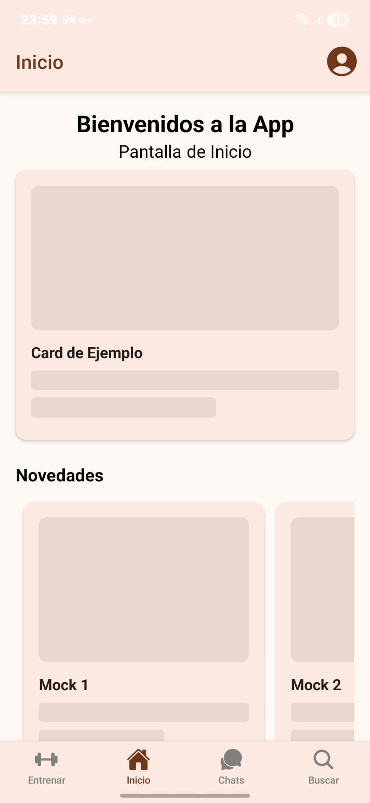
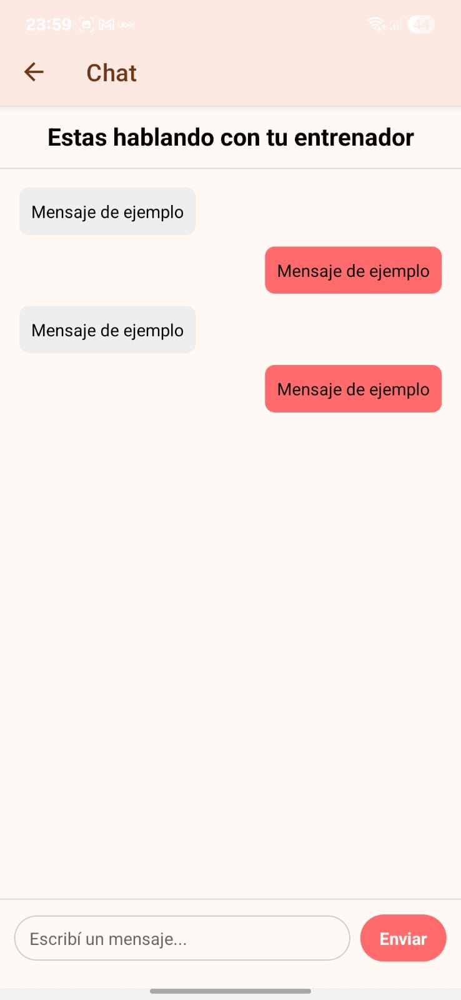
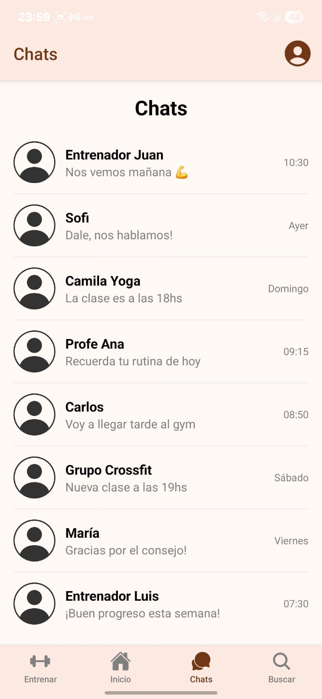
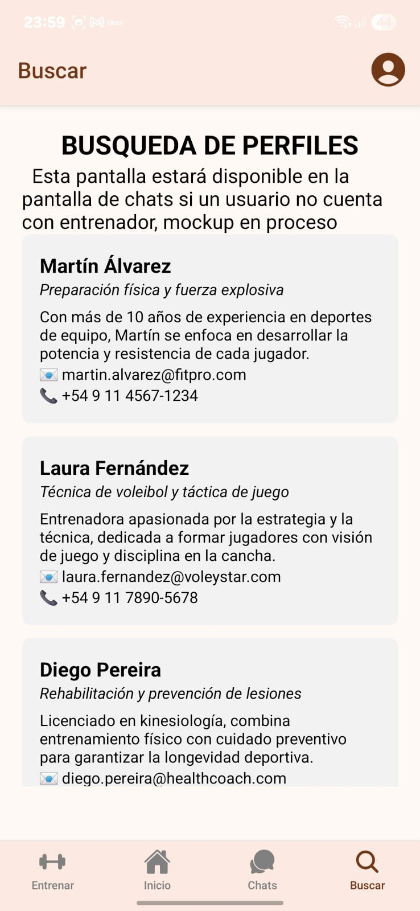
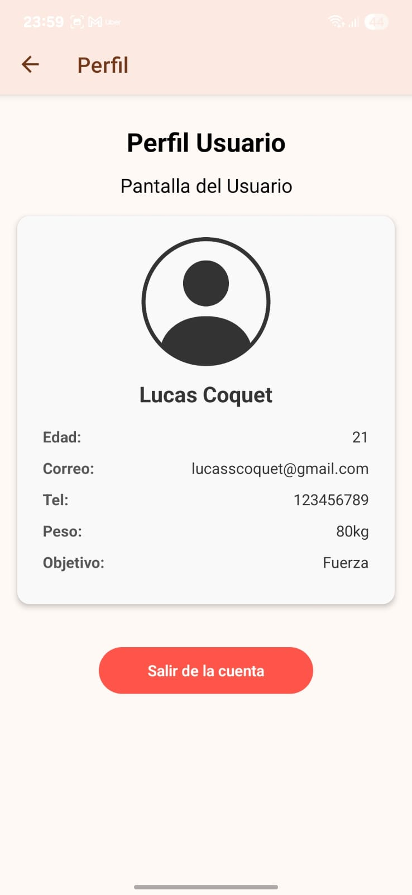

# Proyecto de app móvil para conectar usuarios con entrenadores profesionales
    FitConnect es una app para encontrar profesionales del mundo del fitness, como entrenadores y nutricionistas.
        Accede al consejo de los profesionales a traves del chat, o encuentros presenciales.
        Haz un seguimiento de tus rutinas y dietas proporcionados por los profesionales
        Registra tu evolucion en la app.
## Descripción de pantallas
 (Hay mas pantallas en la app)
- **Inicio / Home:** Pantalla principal con acceso rápido a las funciones de la app.  
- **Entrenar:** Pantalla para gestionar rutinas y seguimiento de entrenamiento.  
- **Lista de Chats y Chat:** Lista de conversaciones y acceso al chat individual con entrenadores.  
- **Buscar Perfiles:** Búsqueda de entrenadores dentro de la app.  
- **Perfil Usuario:** Visualización de los datos del usuario y opción para cerrar sesión.  

## Capturas de pantalla
  

  
  
 
